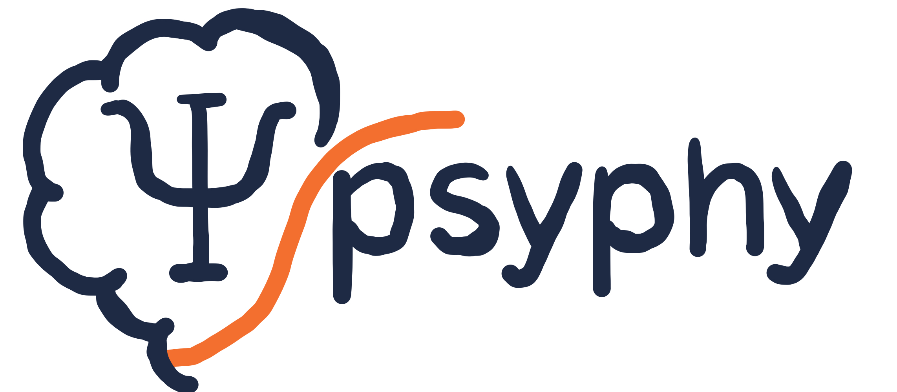

<div align="center">
    <picture>
    <source srcset="docs/images/psyphy_logo_draft.png" media="(prefers-color-scheme: light)"/>
    <source srcset="docs/images/psyphy_logo_draft.png"  media="(prefers-color-scheme: dark)"/>
    <!--  -->
    </picture>
    <h3>Adaptive Design for Psychophysical Experiments</h3>
</div>


<h4 align="center">
  <a href="https://hmd101.github.io/psyphy/#install/">Installation</a> |  
  <a href="https://hmd101.github.io/psyphy/reference/">Documentation</a> | 
  <a href="https://hmd101.github.io/psyphy/examples/mvp/offline_fit_mvp/">Examples</a> | 
  <a href="https://hmd101.github.io/psyphy/CONTRIBUTING/">Contributing</a>
</h4>

Psychophysical modeling and adaptive trial placement. This package provides:

- Wishart Process Psychophysical Model (WPPM)
    - fit to subject's data 
    - predict psychphysical thresholds
    - optional trial placement strategy leveraging model's posterior (e.g., information gain, place next batch of trials such that model's uncertainty is maximally reduced)
- Priors and noise models
    - supports cold and warm starts where warm means initialzing with parameters from previous subjects fitted parameters
    - Noise Model: 
        - default: Gaussian
        - supports Student's T 
- Task likelihoods 
    - currently supports OddityTask, TwoAFC
- Inference engines (MAP, Langevin, Laplace)
- Posterior wrappers and diagnostics
- Trial placement strategies (grid, staircase, information gain)
    - supports online and batchwise trial placement
- Experiment session orchestration
    - reading session data and exporting next batch of trial placments


## Install (editable)

```bash
git clone https://github.com/hmd101/psyphy.git
cd psyphy
pip install -e .

```

## Quickstart (MVP)
If you already have data and just want to fit and predict without the experiment orchestrator, otherwise [go here](https://hmd101.github.io/psyphy/usage/) for a more comprehensive example including the entire experiment orchestrator.

```python
from psyphy.data.dataset import ResponseData
from psyphy.model import WPPM, Prior, TwoAFC
from psyphy.inference.map_optimizer import MAPOptimizer
import optax
import jax.numpy as jnp
# Prepare data
# Create an empty container for trials (reference, probe, response)
data = ResponseData()

# Add one trial:
# - ref: reference stimulus (shape: (input_dim,))
# - probe: probe stimulus (same shape as ref)
# - resp: binary response in {0, 1}; TwoAFC log-likelihood treats 1 as "correct"
data.add_trial(ref=jnp.array([0.0, 0.0]), probe=jnp.array([0.1, 0.0]), resp=1)

# Add another trial (subject responded 0 = "incorrect")
data.add_trial(ref=jnp.array([0.0, 0.0]), probe=jnp.array([0.0, 0.1]), resp=0)

# Model
model = WPPM(input_dim=2, prior=Prior.default(2), task=TwoAFC())

# Optimizer config (SGD + momentum)
opt = optax.sgd(learning_rate=5e-4, momentum=0.9)
posterior = MAPOptimizer(steps=500, optimizer=opt).fit(model, data)

# Predictions
p = posterior.predict_prob((jnp.array([0.0, 0.0]), jnp.array([0.05, 0.05])))
contour = posterior.predict_thresholds(reference=jnp.array([0.0, 0.0]))
```


## Background

This package implements methods described in:
-  [Hong et al. (2025). *Comprehensive characterization of human color discrimination thresholds*.](https://www.biorxiv.org/content/10.1101/2025.07.16.665219v1)

While the paper above  used AEPsych (a Gaussian Process–based trial placer),
`psyphy` integrates trial placement directly with the WPPM posterior (e.g. via InfoGain/EAVC),
making the  adaptive trial placement model-aware.

## Docs

Build and preview the documentation locally:

```bash
# from repo root
source .venv/bin/activate
pip install mkdocs mkdocs-material 'mkdocstrings[python]'
mkdocs serve
```

Build the static site:

```bash
mkdocs build
```

Deploy to GitHub Pages (manual):

```bash
mkdocs gh-deploy --clean
```

For contributors, see CONTRIBUTING.md for full doc guidelines and NumPy-style docstrings.
