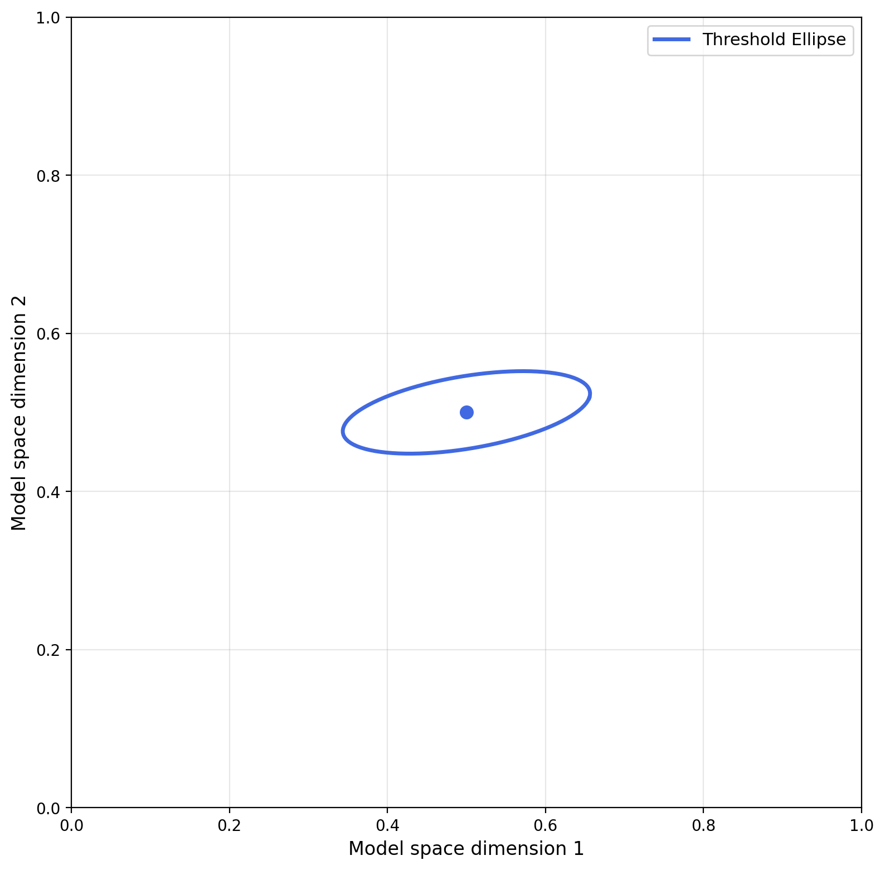
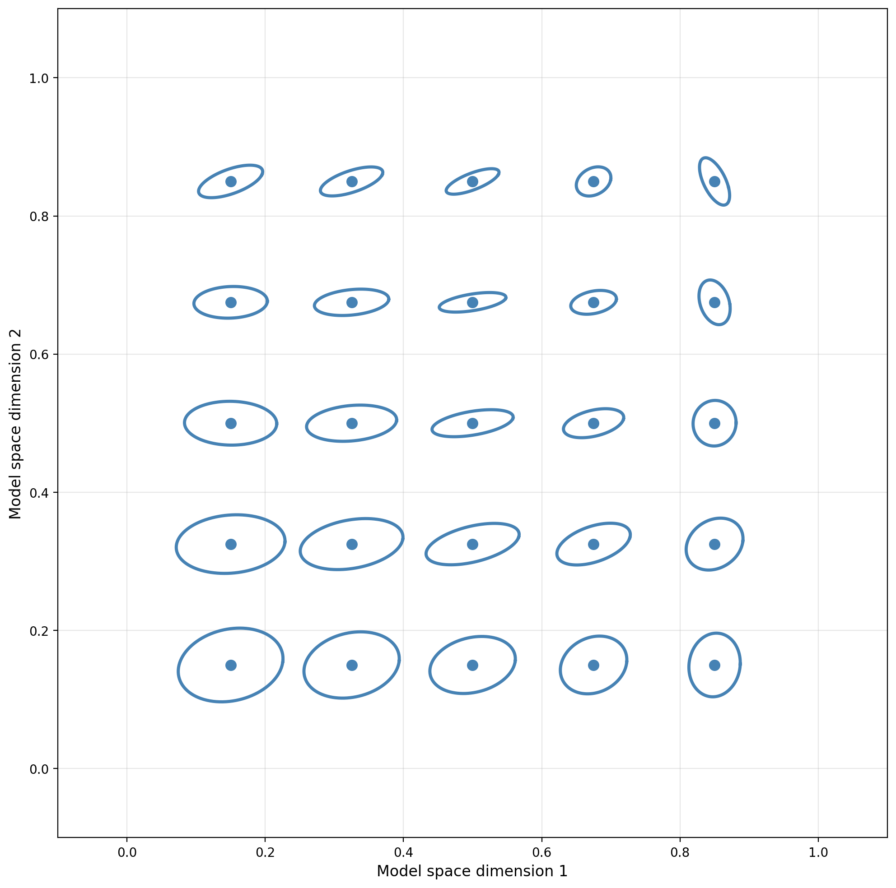

# Covariance Field: Visualizing Spatially-Varying Thresholds

This example demonstrates how to work with the **`WPPMCovarianceField`** abstraction for visualizing spatially-varying perceptual thresholds in the Wishart Process Psychophysical Model (WPPM).

The covariance field provides a clean, functional interface for:
- Evaluating covariance matrices at different stimulus locations

- Visualizing threshold countours (as ellipses)

- Understanding how perceptual noise varies across stimulus space

You can run this complete example yourself with:
```bash
python docs/examples/covariance_field/covariance_field_demo.py
```

---

## Mathematical Background

A **covariance field** $\Sigma(x)$ maps stimulus locations to covariance matrices, representing how perceptual thresholds vary across space.

### Wishart Process Covariance
The full WPPM uses a Wishart Process to model spatially-varying, full covariance:

$$
\Sigma(x) = U(x) \, U(x)^\top + \lambda I
$$

where:

$$
U(x) = \sum_{ij} W_{ij} \, \phi_{ij}(x)
$$

- $\phi_{ij}(x)$: Chebyshev basis functions
- $W_{ij}$: Learned coefficients
- $\lambda$: Numerical stabilizer (`diag_term`)


---

## Imports

```python title="Required Imports"
--8<-- "docs/examples/covariance_field/covariance_field_demo.py:imports"
```

---

## Example 1: Single Point Threshold Ellipse

### Creating a Wishart Covariance Field

First, we create a WPPM model in Wishart mode with **5×5 basis functions** (`basis_degree=4`) and sample a covariance field from the prior:

```python title="Create Wishart Model and Sample Field"
--8<-- "docs/examples/covariance_field/covariance_field_demo.py:single_point"
```

**Key parameters:**
- `basis_degree=4`: Activates Wishart mode with 5×5 Chebyshev basis functions (degrees 0-4)
- `extra_dims=1`: Adds embedding dimensions for richer covariance structure
- `variance_scale=0.03`, `decay_rate=0.3`: Control spatial smoothness
- `field(x)`: Callable interface makes the field feel like a mathematical function

### Visualizing a Single Threshold Ellipse

We can visualize the threshold at a single point as an ellipse:


<div align="center">
    <picture>
    
    </picture>
    <p><em>Threshold ellipse at point (0.5, 0.5). The ellipse shape encodes the covariance structure: elongation shows correlation direction, size shows threshold magnitude.</em></p>
</div>


---

## Example 2: Covariance Field Grid

### Batch Evaluation Across Stimulus Space

To see how thresholds vary across space, we evaluate the covariance field at multiple points:

```python title="Create Grid and Evaluate"
--8<-- "docs/examples/covariance_field/covariance_field_demo.py:grid_points"
```

**Batch evaluation methods:**
1. `field.cov_batch(X)` - Explicit batch method
2. `jax.vmap(field)(X)` - JAX vmap on callable interface
3. both are equivalent and efficient

### Visualizing the Ellipse Field


<div align="center">
    <picture>
    
    </picture>
    <p><em>5×5 grid of uncertainty ellipses showing spatial variation. note how ellipse size, shape, and orientation vary smoothly across the stimulus space.</em></p>
</div>


---

## Example 3: Custom Covariance Fields

### Sampling Different Fields

You can sample multiple fields from the prior or create fields from custom parameters:

```python title="Custom Field from Different Prior Sample"
--8<-- "docs/examples/covariance_field/covariance_field_demo.py:custom"
```

### Visualizing Custom Fields

<div align="center">
    <picture>
    
    </picture>
    <p><em>Different prior sample produces different spatial pattern.</em></p>
</div>


---


## API Reference

### Construction Methods

| Method | Description | Use Case |
|--------|-------------|----------|
| `from_prior(model, key)` | Sample from prior | Initialization, visualization |
| `from_posterior(posterior)` | Extract fitted field | Analysis after fitting |
| `from_params(model, params)` | Custom parameters | testing / load fitted params from e.g. different subject |

### Evaluation Methods

| Method | Input Shape | Output Shape | Description |
|--------|-------------|--------------|-------------|
| `field(x)` | `(d,)` | `(d, d)` | Callable interface |
| `field.cov(x)` | `(d,)` | `(d, d)` | Explicit covariance |
| `field.cov_batch(X)` | `(n, d)` | `(n, d, d)` | Batch evaluation |
| `jax.vmap(field)(X)` | `(n, d)` | `(n, d, d)` | JAX vmap |

where:
- `d` = `embedding_dim` (Wishart mode)
- `n` = number of evaluation points

### Properties

| Property | Returns | Description |
|----------|---------|-------------|
| `field.model` | `WPPM` | Associated model |
| `field.params` | `dict` | Parameter dictionary |

---

## Integration with WPPM Workflow

Here's how the covariance field would integrate into the full WPPM workflow:

```python
# 1. Create model
model = WPPM(
    input_dim=2,
    prior=Prior(input_dim=2, basis_degree=5),
    task=OddityTask(),
    basis_degree=5,
)

# 2. visualize prior uncertainty (optional)
field_prior = WPPMCovarianceField.from_prior(model, key)
plot_ellipse_field(field_prior, grid_points)

# 3. fit model to data
model.fit(data, inference=MAPOptimizer(steps=500))

# 4. Extract learned covariance field
posterior = model.posterior(kind="parameter")
field_fitted = WPPMCovarianceField.from_posterior(posterior)

# 5. Visualize learned uncertainty
plot_ellipse_field(field_fitted, grid_points)
```

---

## Best Practices

### Recommended:

```python
# use callable interface for single points
Sigma = field(x)

# Use batch methods for multiple points
Sigmas = field.cov_batch(X_grid)

# alternatively, use vmap for functional composition
Sigmas = jax.vmap(field)(X_grid)

```

###  Avoid

```python
# don't loop over individual points (inefficient)
for x in X_grid:
    Sigma = field(x)  # bad! Use field.cov_batch(X_grid)

# Don't use wrong shapes
field.cov(X_batch)  # error! Use cov_batch()
```

---
