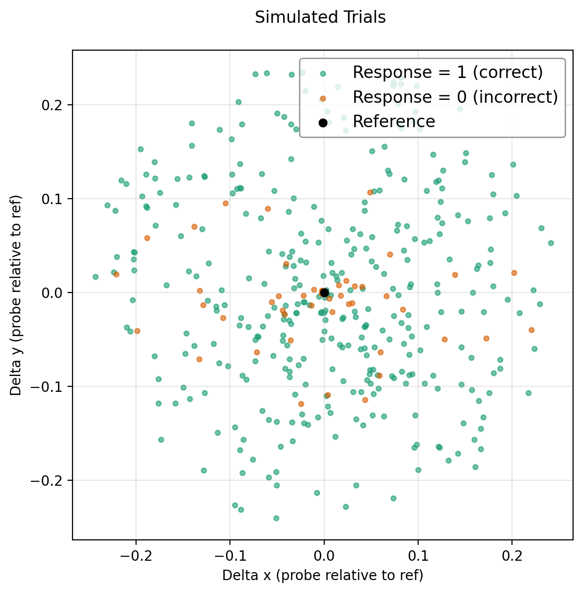
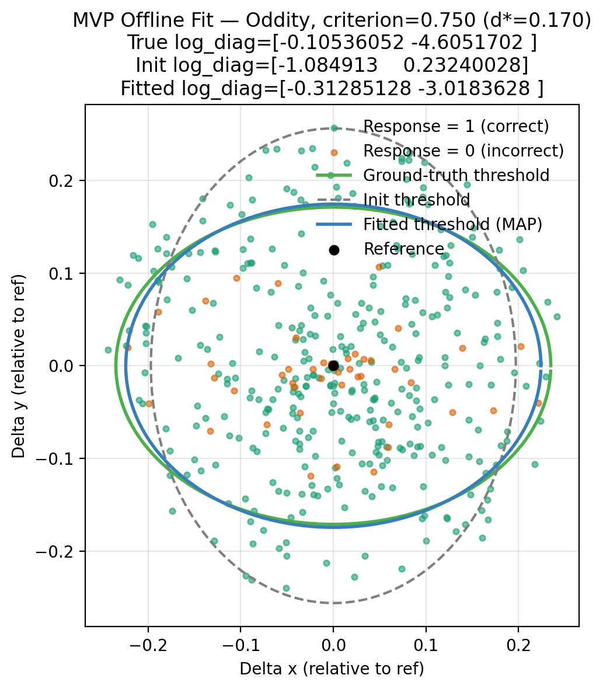
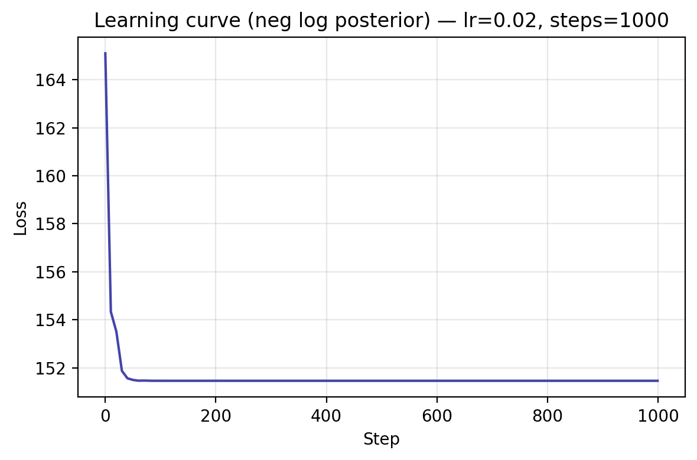

# Predicting Thesholds with MVP WMMP for Simulated Trials

This toy example fits the MVP WPPM model to synthetic 2D data and produced a 
figure showing the predicted thresholds around the reference including 
the ground-truth, init threshold contours.

You can run this example yourself via the corresponding [standalone script](docs/examples/mvp/offline_fit_mvp.py).

## Overview

This example demonstrates how to use the minimal viable product (MVP) version of the Wishart Process Psychophysical Model (WPPM) to:
1. Simulate synthetic behavioral data (responses to reference–probe stimuli),
2. Fit the WPPM to this data via MAP optimization,
3. Visualize *isoperformance contours* (threshold ellipses) implied by the fitted covariance.

The MVP WPPM makes strong simplifying assumptions:
- The local covariance structure of perceptual encoding is constant across space,
- The covariance is diagonal (no correlations -> axis-aligned ellipses),
- Task likelihoods (e.g., Oddity 3AFC) are closed-form mappings from discriminability to response probability.

Future extensions will relax these assumptions using the full Wishart Process framework.


## Data

### Ground Truth Setup
```python title="Truth"
--8<-- "docs/examples/mvp/offline_fit_mvp.py:truth"
```
### Covariance Parameterization

In the MVP, the perceptual encoding at a stimulus location is described by a diagonal covariance matrix:

$$
\Sigma = \mathrm{diag}\big( \exp(\text{log\_diag}) \big)
$$

- `log_diag` is a free parameter vector in $\mathbb{R}^d$.
- Exponentiation ensures variances are always positive.
- The diagonal restriction means no correlations are modeled between stimulus dimensions.
- If the entries of `log_diag` are equal, isoperformance contours are circles; otherwise they are axis-aligned ellipses.

Example:
- `log_diag = [\log 0.04, \log 0.01]` 
-> $\Sigma = \begin{bmatrix}0.04 & 0 \\ 0 & 0.01\end{bmatrix}$


### Simulating Trials


For each trial:

1. Compute discriminability \(d\) between the reference and probe under the ground-truth covariance \(\Sigma\).
2. Map \(d\) to the probability of a correct response using the Oddity task mapping (chance = \(1/3\), monotonically increasing with \(d\)).
3. Sample a binary response (\(0 =\) incorrect (orange), \(1 =\) correct (green)) 

This procedure yields a dataset of probe positions relative to the reference together with simulated subject responses (color-coded), namely if they correctly answered the question: *“Are the reference and probe the same?”*..  


<figure markdown="1">

</figure>

Synthetic trials are generated by placing probes around a fixed reference at random polar coordinates:

- Angle: sampled uniformly in $[0, 2\pi)$,
- Radius: sampled uniformly up to a maximum (here, 0.25).

```python title="Data"
--8<-- "docs/examples/mvp/offline_fit_mvp.py:data"
```


**Caveats: approximation the MVP makes**:

- **Stimuli:** In the MVP, we only simulate *two stimuli* (reference + probe). This looks like a **yes/no same–different task**: *“Are ref and probe the same?”*.
- **Likelihood:** However, the likelihood function assumes a 3AFC oddity mapping as in [Hong et al](https://www.biorxiv.org/content/10.1101/2025.07.16.665219v1.full), where chance performance is 1/3 and performance grows with discriminability. This means the MVP *stimulus structure* resembles 2AFC, but the *response model* is parameterized like 3AFC.

By contrast, in the full model used in [Hong et al](https://www.biorxiv.org/content/10.1101/2025.07.16.665219v1.full) the 3AFC task is set up as follows:
- Three stimuli are explicitly simulated (2 reference samples + 1 probe)
- Internal noisy representations are drawn for all three
- Multiple Mahalanobis distances are computed, and the likelihood is defined by which stimulus is the odd one out.

Thus, the 3AFC stub in the MVP version should be seen as a computational shortcut: a two-stimulus discriminability measure passed through a 3AFC-style mapping.

## Model
```python title="Model"
--8<-- "docs/examples/mvp/offline_fit_mvp.py:model"
```

### Discriminability and Task Mapping

The WPPM defines **discriminability** between a reference $r$ and probe $p$ as the Mahalanobis distance:

$$
d(r, p; \Sigma) = \sqrt{ (p-r)^\top \left(\Sigma + \epsilon I\right)^{-1} (p-r) }
$$

- $\Sigma$ is the local covariance (constant and diagonal in MVP)
- $\epsilon I$ is a small jitter term for numerical stability

For the Oddity task (3AFC), discriminability is mapped to the probability of a correct response:

$$
P(\text{correct} \mid d) = \tfrac{1}{3} + \tfrac{2}{3}\cdot \tfrac{1}{2}\left( \tanh(\text{slope}\cdot d) + 1 \right)
$$

- Chance level is $1/3$,
- Performance rises monotonically with $d$,
- The `slope` parameter controls steepness

## Training / Fitting

```python title="Training"
--8<-- "docs/examples/mvp/offline_fit_mvp.py:training"
```
### MAP Estimation

We fit the model via maximum a posteriori (MAP) optimization:

$$
\hat{\theta} = \arg\max_\theta \Big[ \log p(\text{data}\mid\theta) + \log p(\theta) \Big]
$$

- Parameters: $\theta = \text{log\_diag}$,
- Likelihood: Bernoulli log-likelihood of observed responses given task mapping,
- Prior: Gaussian on `log_diag` (implying log-normal prior on variances).

Optimization uses stochastic gradient descent (`optax.sgd`).

## Results

### Predicted Thresholds 

Given a target criterion (e.g. 75% correct), we compute the required discriminability $d^{*}$ by inverting the task mapping. 

Isoperformance contours (threshold ellipses) around the reference satisfy:

$$
(p-r)^\top \Sigma^{-1} (p-r) = (d^{*})^2
$$

- For diagonal $\Sigma$, this is an axis-aligned ellipse with semi-axes $d^{*}\sqrt{\sigma_x^2}, \ d^{*} \sqrt{\sigma_y^2}$.
- If $\sigma_x = \sigma_y$, the ellipse is a circle.
- With off-diagonal terms (future extension), ellipses can be rotated.

Plots show the ellipses for:
- **ground truth covariance**,
- **Initial prior sample**,
- **fitted parameters (MAP)**.

<figure markdown="1">

</figure>

### Learning Curve
<figure markdown="1">

</figure>


---
---

## Future Extensions
This example provides a minimal but extensible foundation for these developments.
The MVP assumes constant, diagonal covariance. The full WPPM will extend this by:

1. **Spatial variation**: covariance $\Sigma(x)$ varying smoothly with stimulus position
2. **Correlations**: full covariance matrices (non-diagonal, rotated ellipses)
3. **Wishart Process Prior**: placing a structured prior over the entire covariance field,
4. **Monte Carlo tasks**: supporting tasks without closed-form mappings


---


Generated plots from 
this  underlying script:

```bash
python docs/examples/mvp/offline_fit_mvp.py
```

The script writes plots into `docs/examples/mvp/plots/` and this page embeds them.


---

<!-- 
Show code above but don't execute and include generated plots.

- How to format code blocks: https://squidfunk.github.io/mkdocs-material/reference/code-blocks/#usage
- Options for including code from a separate file: https://facelessuser.github.io/pymdown-extensions/extensions/snippets/#snippets-notation
- Options for executing code in blocks: https://pawamoy.github.io/markdown-exec/usage/#render-the-source-code-as-well
- Options for displaying plots: https://pawamoy.github.io/markdown-exec/gallery/#with-matplotlib
- Options for sharing variables between code blocks etc.: https://pawamoy.github.io/markdown-exec/usage
-->