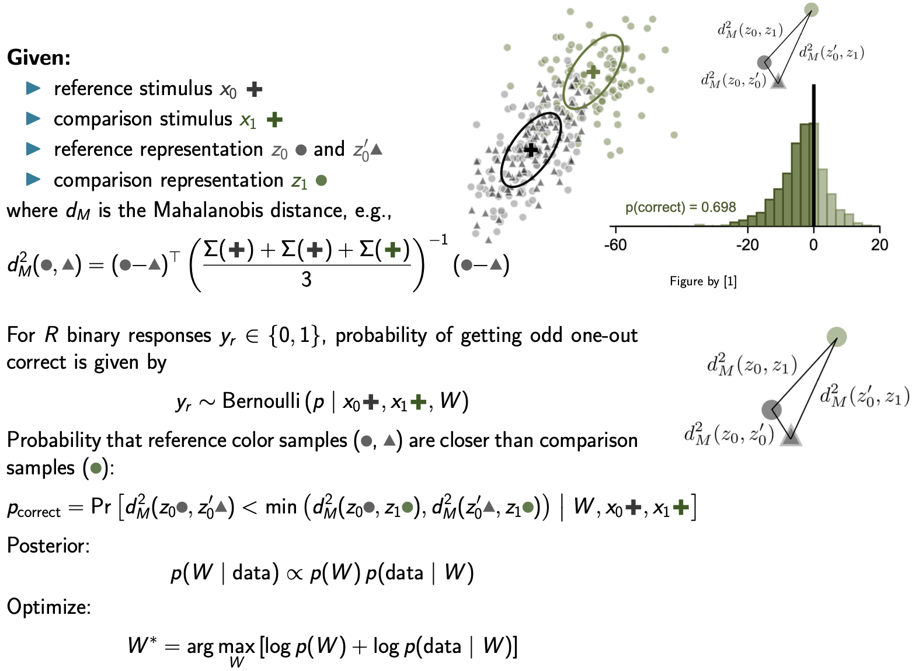

# Predicting Thresholds with MVP WMMP for Simulated Trials

This toy example fits the MVP WPPM model to synthetic 2D data and produces a 
figure showing the predicted thresholds around the reference including 
the ground-truth, init threshold contours.

You can run this example yourself via the corresponding standalone script: 


```bash
python docs/examples/mvp/offline_fit_mvp_with_map_optimizer.py
```

Alternatively, you can take a look at this script that explicitly exposes the training loop in jax and produces the exact same loop:  
```bash
python docs/examples/mvp/offline_fit_mvp.py
```


## Disclaimer

This example shows how to use the **minimal viable product (MVP) version** of the **Wishart Process Psychophysical Model (WPPM)** to:

1. Simulate synthetic behavioral data (responses to reference–probe stimuli),
2. Fit the WPPM to this data via MAP optimization,
3. Visualize *isoperformance contours* (threshold ellipses) implied by the fitted covariance.

The MVP WPPM makes strong simplifying assumptions compared to the full WPPM used in [Hong et al](https://www.biorxiv.org/content/10.1101/2025.07.16.665219v1.full):

- The local covariance structure of perceptual encoding is constant across space,
- The covariance is diagonal (no correlations -> axis-aligned ellipses),
- Task likelihoods (e.g., Oddity 3AFC) are closed-form mappings from discriminability to response probability.

Future extensions will relax these assumptions using the full Wishart Process framework (see bottom of the page).

---
```python title="Imports"
--8<-- "docs/examples/mvp/offline_fit_mvp.py:imports"
```

## Data

### Ground Truth Setup


```python title="Ground Truth"
--8<-- "docs/examples/mvp/offline_fit_mvp.py:truth"
```
### Covariance Parameterization

In the MVP, the perceptual encoding at a stimulus location is described by a diagonal covariance matrix:

$$
\Sigma = \mathrm{diag}\big( \exp(\text{log\_diag}) \big)
$$

- `log_diag` is a free parameter vector, here in 2D
- Exponentiation ensures variances are always positive.
- The diagonal restriction means no correlations are modeled between stimulus dimensions.
- If the entries of `log_diag` are equal, isoperformance contours are circles; otherwise they are axis-aligned ellipses.

Example:
- `log_diag = [\log 0.9, \log 0.01]` 
-> $\Sigma = \begin{bmatrix}0.9 & 0 \\ 0 & 0.01\end{bmatrix}$


### Simulating Trials


For each trial:

1. Compute discriminability $d$ between the reference and probe under the ground-truth covariance $\Sigma$.
2. Map $d$ to the probability of a correct response using the Oddity task mapping (chance = $1/3$, monotonically increasing with $d$).
3. Sample a binary response ($0 =$ incorrect (orange), $1 =$ correct (green)) 

This procedure yields a dataset of probe positions relative to the reference together with simulated subject responses (color-coded), namely if they correctly answered the question: *“Are the reference and probe the same?”*.


```python title="Data"
--8<-- "docs/examples/mvp/offline_fit_mvp.py:data"
```

<div align="center">
    <picture>
    
    </picture>
</div>


**Caveats: approximation the MVP makes**:

- **Stimuli:** In the MVP, we only simulate *two stimuli* (reference + probe). This looks like a **yes/no same–different task**: *“Are ref and probe the same?”*.

By contrast, in the full model used in [Hong et al](https://www.biorxiv.org/content/10.1101/2025.07.16.665219v1.full) the 3AFC task is set up as follows:

- Three stimuli are explicitly simulated (2 reference samples + 1 probe)
- Internal noisy representations are drawn for all three
- Multiple Mahalanobis distances are computed, and the likelihood is defined by which stimulus is the odd one out.

Thus, the 3AFC stub in the MVP version should be seen as a computational shortcut: a two-stimulus discriminability measure passed through a 3AFC-style mapping.

---

## Model
```python title="Model"
--8<-- "docs/examples/mvp/offline_fit_mvp.py:model"
```

### Likelihood–Discriminability Mapping

In the MVP WPPM, the probability of a correct response is a **closed-form mapping**
from discriminability $d$ to performance in a *3AFC Oddity* task (chance = $1/3$) and $p(d=0) = 2/3$.

For each trial $i$:

- Observed response: $y_i \in \{0,1\}$
- Discriminability: $d_i = d(r_i, p_i; \Sigma)$
- Predicted probability of a correct response:

$$
p_i = \frac{1}{3} + \frac{2}{3} \cdot \frac{1}{2}\left[\tanh(\text{slope}\, d_i) + 1\right]
$$

This mapping approximates the expected accuracy of an ideal observer in a 3AFC task
as a sigmoid-like function of discriminability $d_i$.
The `slope` parameter controls the steepness of the psychometric curve.

The **per-trial likelihood** is a Bernoulli probability mass function:

$$
p(y_i \mid d_i, \theta) = p_i^{y_i}\,(1-p_i)^{1-y_i}
$$

and the **dataset log-likelihood** used for model fitting is:

$$
\log p(\text{data}\mid\theta)
= \sum_i \Big[ y_i\,\log p_i + (1-y_i)\,\log(1-p_i) \Big].
$$

Here, $\theta = \text{log\_diag}$ are the model parameters defining
the diagonal covariance $\Sigma = \mathrm{diag}(\exp(\text{log\_diag}))$.

This log-likelihood is computed in `WPPM.log_likelihood_from_data`, which:

1. Computes all discriminabilities $d_i$ using the current parameters,
2. Passes them to the task’s `loglik` method (in `task.py`), which implements the Bernoulli log probability.

_Note_ again that this is a stub for the full WPPM model which will define the discrimanability thresholds slightly differently (see further down).


---

## Training / Fitting
We now define the training loop that minimizes the model’s negative log posterior using stochastic gradient descent and momentum.
If you'd like to plot the learning curve lateron,  `MapOptimizer()` simply set the attribute `track_history` to `True`.
This will enable you to collect the loss history for plotting via `optimizer.get_history()`.
```python title="Fitting with psyphy"
--8<-- "docs/examples/mvp/offline_fit_mvp_with_map_optimizer.py:training"
```

### [Optional] exposing psyphy's MAP implementation in Jax
The code below produces the exact same figures as the previous training loop setup using `psyphy`. 
This is meant for the interested reader curious about why and how we use JAX and optax for all of our optimizers
in the `inference` module.

**A note on JAX:**
The key feature here is JAX’s Just-In-Time (JIT) compilation, which transforms our Python function into a single, optimized computation graph that runs efficiently on CPU, GPU, or TPU.
To make this work, we represent parameters and optimizer states as PyTrees (nested dictionaries or tuples of arrays) — a core JAX data structure that supports efficient vectorization and differentiation.
This approach lets us scale optimization and inference routines from small CPU experiments to large GPU-accelerated Bayesian models with minimal code changes.

```python title="Optional: training loop exposing psyphy's MAP implementation in Jax"
--8<-- "docs/examples/mvp/offline_fit_mvp.py:training"
```
### MAP Estimation

The goal is to estimate the WPPM parameters (the diagonal covariance entries in log-space) given simulated behavioral data.

We fit the model via maximum a posteriori (MAP) optimization:

$$
\hat{\theta} = \arg\max_\theta \Big[ \log p(\text{data}\mid\theta) + \log p(\theta) \Big]
$$

- Parameters: $\theta = \text{log\_diag}$,
- Likelihood: Bernoulli log-likelihood of observed responses given task mapping (see above),
- Prior: Gaussian on `log_diag` (implying log-normal prior on variances).

Here, optimization uses stochastic gradient descent (`optax.sgd`).

## Results

### Predicted Thresholds 

Given a target criterion (e.g. 75% correct), we compute the required discriminability $d^{*}$ by inverting the task mapping. 

Isoperformance contours (threshold ellipses) around the reference satisfy:

$$
(p-r)^\top \Sigma^{-1} (p-r) = (d^{*})^2
$$

```python title="Collecting fitted parameters"
--8<-- "docs/examples/mvp/offline_fit_mvp_with_map_optimizer.py:params_extraction"
```

Plots show the ellipses for:

- **ground truth covariance**,
- **Initial prior sample**,
- **fitted parameters (MAP)**.

```python title="Show init / true / fitted threshold ellipsoids"
--8<-- "docs/examples/mvp/offline_fit_mvp_with_map_optimizer.py:plot_contours"
```

<div align="center">
    <picture>
    
    </picture>
</div>

### Learning Curve
```python title="Collecting loss history and plotting"
--8<-- "docs/examples/mvp/offline_fit_mvp_with_map_optimizer.py:loss_history"
```
<div align="center">
    <picture>
    
    </picture>
</div>

---


## Simplifications in the MVP WPPM (Stub) and future extensions:

---
### Coming soon: The Full Observation Model and WPPM:

In the full **Observation/Likelihood Model** ([Hong et al](https://www.biorxiv.org/content/10.1101/2025.07.16.665219v1.full)), three external stimuli are presented in each trial and we use three noisy representations to compute the task likeihood, which cannot be evaluated in closed form and we evaluate it via Monte Carlo sampling:

<!-- <figure markdown="1">

</figure> -->

<div align="center">
    <picture>
    
    </picture>
    <h5>Coming soon: The Full Observation Model and WPPM</h5>
</div>


The covariance field $\Sigma(x)$ itself is drawn from a **Wishart Process Prior** parameterized through spatially smooth basis functions $\phi_{ij}(x)$ and weights $W$:

<div align="center">
    <picture>
    
    </picture>
    <h5>Covariance field $\Sigma(x)$  drawn from a Wishart Process Prior</h5>
</div>


---

### Comparison:  MVP WPPM vs. Full WPPM as in [Hong et al](https://www.biorxiv.org/content/10.1101/2025.07.16.665219v1.full)
The **MVP version** used here simplifies this full generative model in several  ways:

| Component | Full Model ([Hong et al](https://www.biorxiv.org/content/10.1101/2025.07.16.665219v1.full)) | MVP WPPM (stub) |
|------------|--------------------------|-----------|
| **Stimuli per trial** | 3 stimuli (ref + 2 comparisons) | 2 stimuli (ref + probe) |
| **Internal noise** | Explicit noisy draws $z \sim \mathcal{N}(x, \Sigma(x))$ | Not sampled; uses deterministic Mahalanobis distance |
| **Covariance structure** | Spatially varying $\Sigma(x)$ from a Wishart Process | Constant diagonal $\Sigma = \mathrm{diag}(\exp(\text{log\_diag}))$ |
| **Likelihood computation** | Monte Carlo probability of correct odd-one-out | Closed-form Bernoulli mapping $d \to p(\text{correct})$ |
| **Number of Mahalanobis distances** | Several (triplet comparisons) | Single (reference–probe) |
| **Optimization** | MAP or Langevin inference over weights $W$ | MAP over log variances $\text{log\_diag}$ |


---

### Future Extensions
This example provides a minimal but extensible foundation for these developments.
The MVP assumes constant, diagonal covariance. The full WPPM will extend this by:

1. **Spatial variation**: covariance $\Sigma(x)$ varying smoothly with stimulus position
2. **Correlations**: full covariance matrices (non-diagonal, rotated ellipses)
3. **Wishart Process Prior**: placing a smoothly varying prior over the entire covariance field,
4. **Monte Carlo tasks**: supporting tasks without closed-form mappings

---

Generated plots from this underlying script:

```bash
python docs/examples/mvp/offline_fit_mvp.py
```

The script writes plots into `docs/examples/mvp/plots/` and this page embeds them.

---

<!-- 
Show code above but don't execute and include generated plots.

- How to format code blocks: https://squidfunk.github.io/mkdocs-material/reference/code-blocks/#usage
- Options for including code from a separate file: https://facelessuser.github.io/pymdown-extensions/extensions/snippets/#snippets-notation
- Options for executing code in blocks: https://pawamoy.github.io/markdown-exec/usage/#render-the-source-code-as-well
- Options for displaying plots: https://pawamoy.github.io/markdown-exec/gallery/#with-matplotlib
- Options for sharing variables between code blocks etc.: https://pawamoy.github.io/markdown-exec/usage
-->