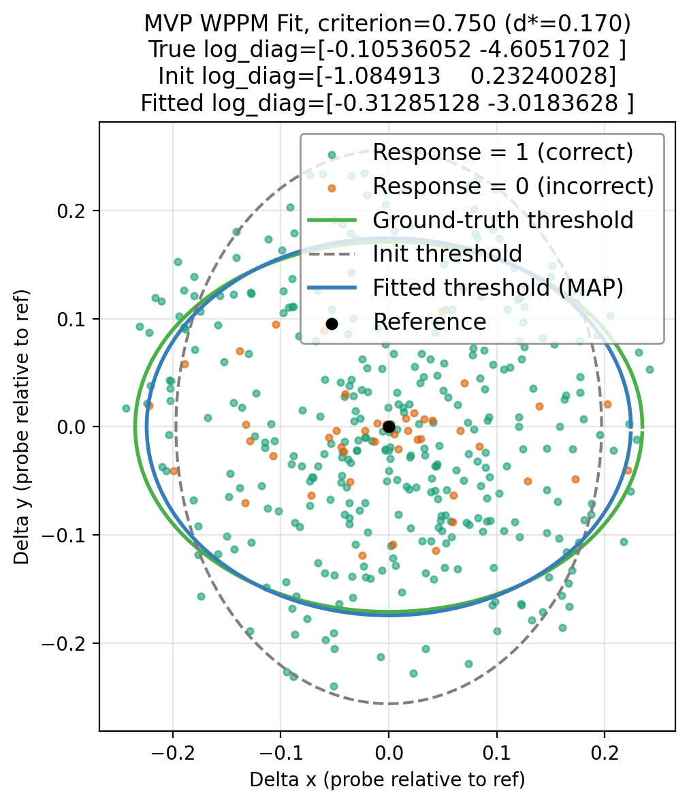
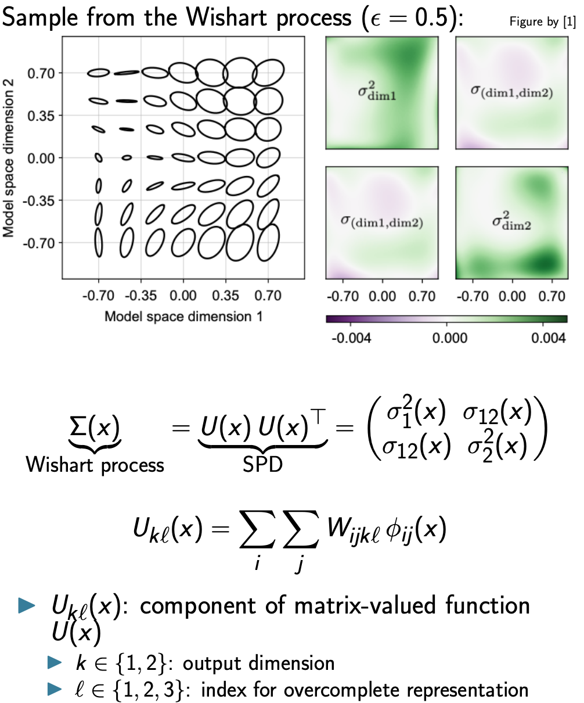

# Predicting Thesholds with MVP WMMP for Simulated Trials

This toy example fits the MVP WPPM model to synthetic 2D data and produced a 
figure showing the predicted thresholds around the reference including 
the ground-truth, init threshold contours.

You can run this example yourself via the corresponding standalone script at `docs/examples/mvp/offline_fit_mvp.py`.

## Overview

This example demonstrates how to use the minimal viable product (MVP) version of the Wishart Process Psychophysical Model (WPPM) to:
1. Simulate synthetic behavioral data (responses to reference–probe stimuli),
2. Fit the WPPM to this data via MAP optimization,
3. Visualize *isoperformance contours* (threshold ellipses) implied by the fitted covariance.

The MVP WPPM makes strong simplifying assumptions:
- The local covariance structure of perceptual encoding is constant across space,
- The covariance is diagonal (no correlations -> axis-aligned ellipses),
- Task likelihoods (e.g., Oddity 3AFC) are closed-form mappings from discriminability to response probability.

Future extensions will relax these assumptions using the full Wishart Process framework.


## Data

### Ground Truth Setup
```python title="Imports"
--8<-- "docs/examples/mvp/offline_fit_mvp.py:imports"
```

```python title="Ground Truth"
--8<-- "docs/examples/mvp/offline_fit_mvp.py:truth"
```
### Covariance Parameterization

In the MVP, the perceptual encoding at a stimulus location is described by a diagonal covariance matrix:

$$
\Sigma = \mathrm{diag}\big( \exp(\text{log\_diag}) \big)
$$

- `log_diag` is a free parameter vector in $\mathbb{R}^d$.
- Exponentiation ensures variances are always positive.
- The diagonal restriction means no correlations are modeled between stimulus dimensions.
- If the entries of `log_diag` are equal, isoperformance contours are circles; otherwise they are axis-aligned ellipses.

Example:
- `log_diag = [\log 0.04, \log 0.01]` 
-> $\Sigma = \begin{bmatrix}0.04 & 0 \\ 0 & 0.01\end{bmatrix}$


### Simulating Trials


For each trial:

1. Compute discriminability $d$ between the reference and probe under the ground-truth covariance $\Sigma$.
2. Map $d$ to the probability of a correct response using the Oddity task mapping (chance = $1/3$, monotonically increasing with $d$).
3. Sample a binary response ($0 =$ incorrect (orange), $1 =$ correct (green)) 

This procedure yields a dataset of probe positions relative to the reference together with simulated subject responses (color-coded), namely if they correctly answered the question: *“Are the reference and probe the same?”*.


<figure markdown="1">

</figure>

Synthetic trials are generated by placing probes around a fixed reference at random polar coordinates:

- Angle: sampled uniformly in $[0, 2\pi)$,
- Radius: sampled uniformly up to a maximum (here, 0.25).

```python title="Data"
--8<-- "docs/examples/mvp/offline_fit_mvp.py:data"
```


**Caveats: approximation the MVP makes**:

- **Stimuli:** In the MVP, we only simulate *two stimuli* (reference + probe). This looks like a **yes/no same–different task**: *“Are ref and probe the same?”*.

By contrast, in the full model used in [Hong et al](https://www.biorxiv.org/content/10.1101/2025.07.16.665219v1.full) the 3AFC task is set up as follows:

- Three stimuli are explicitly simulated (2 reference samples + 1 probe)
- Internal noisy representations are drawn for all three
- Multiple Mahalanobis distances are computed, and the likelihood is defined by which stimulus is the odd one out.

Thus, the 3AFC stub in the MVP version should be seen as a computational shortcut: a two-stimulus discriminability measure passed through a 3AFC-style mapping.

## Model
```python title="Model"
--8<-- "docs/examples/mvp/offline_fit_mvp.py:model"
```

### Discriminability and Task Mapping

The WPPM defines **discriminability** between a reference $r$ and probe $p$ as the Mahalanobis distance:

$$
d(r, p; \Sigma) = \sqrt{ (p-r)^\top \left(\Sigma + \epsilon I\right)^{-1} (p-r) }
$$

where

- $p$ is a pair of reference and probe stimulus
- $\Sigma$ is the local covariance (constant and diagonal in MVP)
- $\epsilon I$ is a small jitter term for numerical stability

For the Oddity task (3AFC), discriminability is mapped to the probability of a correct response:

$$
P(\text{correct} \mid d) = \tfrac{1}{3} + \tfrac{2}{3}\cdot \tfrac{1}{2}\left( \tanh(\text{slope}\cdot d) + 1 \right)
$$

- Chance level is $1/3$,
- Performance rises monotonically with $d$,
- The `slope` parameter controls steepness


---

### Likelihood Definition

The likelihood arises from the probability of observing each binary response (correct/incorrect) under the model’s predicted performance for a given discriminability value.

For each trial $i$:
- Observed response: $y_i \in \{0,1\}$
- Discriminability: $d_i = d(r_i, p_i; \Sigma)$
- Predicted success probability:

$$
p_i = \frac{1}{3} + \frac{2}{3}\cdot\frac{1}{2}\left[\tanh(\text{slope}\, d_i) + 1\right]
$$

The **trial likelihood** is Bernoulli:

$$
p(y_i \mid d_i, \theta) = p_i^{y_i}\,(1-p_i)^{1-y_i}
$$

and the **dataset log-likelihood** used for fitting is:

$$
\log p(\text{data}\mid\theta) = \sum_i \Big[ y_i\,\log p_i + (1-y_i)\,\log(1-p_i) \Big]
$$

where $\theta = \text{log\_diag}$ are the model parameters defining $\Sigma = \mathrm{diag}(\exp(\text{log\_diag}))$.

This log-likelihood is computed in `WPPM.log_likelihood_from_data`, which:
1. Computes all discriminabilities $d_i$ using the current parameters,
2. Passes them to the task’s `loglik` method (in `task.py`), which implements the Bernoulli log probability.

<!-- The overall **MAP objective** adds a Gaussian log prior (from `prior.py`) on `log_diag`:

$$
\mathcal{L}(\theta) = -\Big( \log p(\text{data}\mid\theta) + \log p(\theta) \Big)
$$

and is optimized with stochastic gradient descent.

--- -->

---

## Training / Fitting

```python title="Training"
--8<-- "docs/examples/mvp/offline_fit_mvp.py:training"
```
### MAP Estimation

The goal is to estimate the WPPM parameters (the diagonal covariance entries in log-space) given simulated behavioral data.

We fit the model via maximum a posteriori (MAP) optimization:

$$
\hat{\theta} = \arg\max_\theta \Big[ \log p(\text{data}\mid\theta) + \log p(\theta) \Big]
$$

- Parameters: $\theta = \text{log\_diag}$,
- Likelihood: Bernoulli log-likelihood of observed responses given task mapping (see above),
- Prior: Gaussian on `log_diag` (implying log-normal prior on variances).

Optimization uses stochastic gradient descent (`optax.sgd`).

## Results

### Predicted Thresholds 

Given a target criterion (e.g. 75% correct), we compute the required discriminability $d^{*}$ by inverting the task mapping. 

Isoperformance contours (threshold ellipses) around the reference satisfy:

$$
(p-r)^\top \Sigma^{-1} (p-r) = (d^{*})^2
$$

- For diagonal $\Sigma$, this is an axis-aligned ellipse with semi-axes $d^{*}\sqrt{\sigma_x^2}, \ d^{*} \sqrt{\sigma_y^2}$.
- If $\sigma_x = \sigma_y$, the ellipse is a circle.
- With off-diagonal terms (future extension), ellipses can be rotated.

Plots show the ellipses for:

- **ground truth covariance**,
- **Initial prior sample**,
- **fitted parameters (MAP)**.

<figure markdown="1">

</figure>

### Learning Curve
<figure markdown="1">

</figure>

---

## Simplicfications in the MVP WPPM (Stub) and future extensions:

### Coming soon: The Full Observation Model and WPPM:

In the full **Observation/Likelihood Model** (Hong et al.), three external stimuli are presented in each trial and we use three noisy representations to compute the task likeihood, which cannot be evaluated in closed form and we evaluate it via Monte Carlo sampling:

<figure markdown="1">

</figure>
<!-- 1. A reference $x_0$,
2. Two comparison stimuli $x_1$ and $x_2$.
 
Each stimulus has an internal representation $z \sim \mathcal{N}(x, \Sigma(x))$.  
The observer’s decision in a 3AFC *oddity* task is based on **comparing multiple Mahalanobis distances** between these noisy internal samples of the reference $z_i$ and $z_j$:

$$
d_M^2(z_i, z_j) = (z_i - z_j)^\top 
\Bigg( \frac{\Sigma(x_i) + \Sigma(x_j) + \Sigma(x_k)}{3} \Bigg)^{-1}
(z_i - z_j)
$$

The likelihood of a correct response is then defined as the probability that the odd (reference) pair is more distant than the two same pairs, i.e.

$$
p_\text{correct}
= \Pr\!\left[
d_M^2(z_0, z_0') < \min\!\big(d_M^2(z_0, z_1), d_M^2(z_0', z_1)\big)
\;\middle|\; W, x_0, x_1
\right]
$$ 

This likelihood cannot be expressed in closed form and is typically **evaluated via Monte Carlo sampling** of the internal representations $z$.  
The covariance field $\Sigma(x)$ itself is drawn from a **Wishart Process Prior**, parameterized through spatially smooth basis functions and weights $W$:

$$
\Sigma(x) = U(x) U(x)^\top, \quad
U_{k\ell}(x) = \sum_i \sum_j W_{ijk\ell}\, \phi_{ij}(x)
$$  -->

The covariance field $\Sigma(x)$ itself is drawn from a **Wishart Process Prior** parameterized through spatially smooth basis functions $\phi_{ij}(x)$ and weights $W$:

<figure markdown="1">

</figure>


---

### Simplifications in the MVP WPPM

The **MVP version** used here simplifies this full generative model in several key ways:

| Component | Full Model (Hong et al.) | MVP WPPM (stub) |
|------------|--------------------------|-----------|
| **Stimuli per trial** | 3 stimuli (ref + 2 comparisons) | 2 stimuli (ref + probe) |
| **Internal noise** | Explicit noisy draws $z \sim \mathcal{N}(x, \Sigma(x))$ | Not sampled; uses deterministic Mahalanobis distance |
| **Covariance structure** | Spatially varying $\Sigma(x)$ from a Wishart Process | Constant diagonal $\Sigma = \mathrm{diag}(\exp(\text{log\_diag}))$ |
| **Likelihood computation** | Monte Carlo probability of correct odd-one-out | Closed-form Bernoulli mapping $d \to p(\text{correct})$ |
| **Number of Mahalanobis distances** | Several (triplet comparisons) | Single (reference–probe) |
| **Optimization** | MAP or Langevin inference over weights $W$ | MAP over log variances $\text{log\_diag}$ |


---

### Future Extensions
This example provides a minimal but extensible foundation for these developments.
The MVP assumes constant, diagonal covariance. The full WPPM will extend this by:

1. **Spatial variation**: covariance $\Sigma(x)$ varying smoothly with stimulus position
2. **Correlations**: full covariance matrices (non-diagonal, rotated ellipses)
3. **Wishart Process Prior**: placing a smoothly varying prior over the entire covariance field,
4. **Monte Carlo tasks**: supporting tasks without closed-form mappings

---

Generated plots from 
this  underlying script:

```bash
python docs/examples/mvp/offline_fit_mvp.py
```

The script writes plots into `docs/examples/mvp/plots/` and this page embeds them.

---

<!-- 
Show code above but don't execute and include generated plots.

- How to format code blocks: https://squidfunk.github.io/mkdocs-material/reference/code-blocks/#usage
- Options for including code from a separate file: https://facelessuser.github.io/pymdown-extensions/extensions/snippets/#snippets-notation
- Options for executing code in blocks: https://pawamoy.github.io/markdown-exec/usage/#render-the-source-code-as-well
- Options for displaying plots: https://pawamoy.github.io/markdown-exec/gallery/#with-matplotlib
- Options for sharing variables between code blocks etc.: https://pawamoy.github.io/markdown-exec/usage
-->