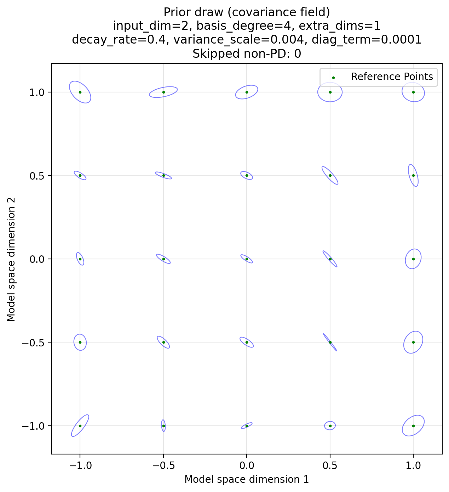
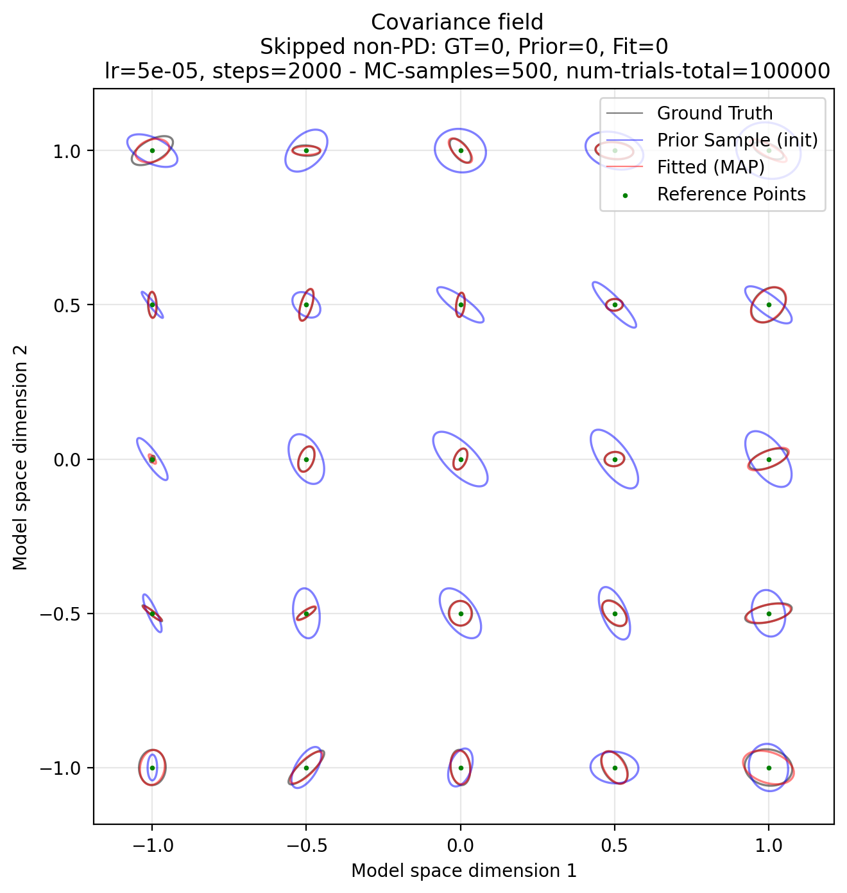
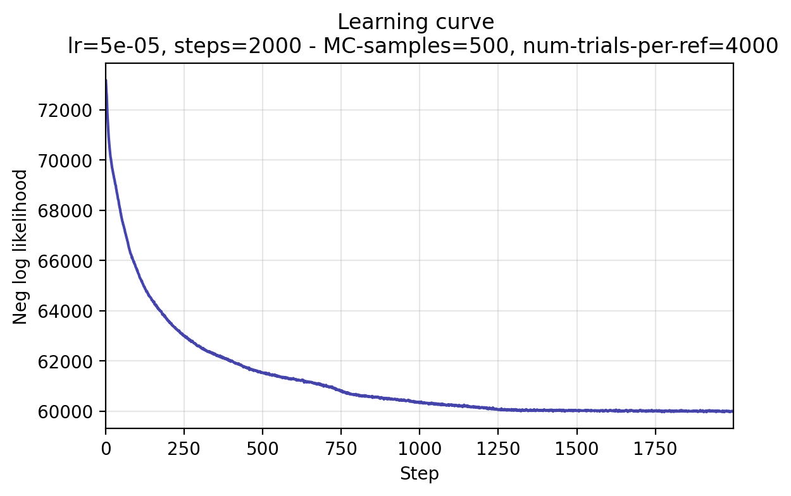

# Full WPPM fit (end-to-end) — simulated 2D data

This tutorial explains what the example script [`full_wppm_fit_example.py`](full_wppm_fit_example.py) is doing, and where the key functions live in the `psyphy` codebase.

- **Goal:** Fit a *spatially varying covariance field* \(\Sigma(x)\) over a 2D stimulus space \(x \in [-1,1]^2\) using the **Wishart Process Psychophysical Model (WPPM)**.
- **Data:** synthetic oddity-task responses simulated from a ``ground-truth'' WPPM.
- **Inference:** MAP (maximum a posteriori) optimization of the WPPM parameters.

> You can treat this as a ``recipe'' for using the Wishart Psychophysical Process Model (WPPM) in your own project: build a model, initialize parameters, fit the model, and visualize fitted predicted thresholds.

NOTE: Running this script takes about 3 min on a A100 40GB.
If you want to accelarate it to for example run it on a CPU, decrease the number of MC-Samples _significantly_ (e.g., 5) and the number of steps the optimizer is running for.

---

## What the Wishart Psychophysical Process Model (WPPM) is in a nutshell

WPPM defines a *covariance matrix field* \(\Sigma(x)\) over stimulus space (e.g. color represented in RGB). Intuitively, \(\Sigma(x)\) describes the local noise/uncertainty ellipse around stimulus \(x\) where stimulus within that ellipse will be perceived as identical to the human observer.

The model represents \(\Sigma(x)\) as

\[
\Sigma(x) = U(x)U(x)^\top + \varepsilon I,
\]

where \(U(x)\) is a smooth, basis-expanded matrix-valued function and \(\varepsilon\) is a small diagonal “jitter” (`diag_term`) to avoid numerical issues. Alternatively, in Gaussian Process (GP) terms, you can think of \(U(x)\) defining a GP in weight space, i.e., a "Bayesian linear model".

A psychophysical task model (here: `OddityTask`) uses \(\Sigma\) to compute probability of a correct response on each trial, and `MAPOptimizer` fits WPPM parameters by maximizing

\[
\log p(\theta \mid \mathcal{D}) = \log p(\mathcal{D} \mid \theta) + \log p(\theta).
\]


For more details on how the Wishart Psychophysical Model (WPPM) works, and the psychophysical task used in this example,  please checkout the paper by [Hong et al (2025)](https://elifesciences.org/reviewed-preprints/108943) and this [tutorial](`docs/examples/wppm/wppm_tutorial.md`).


---

## Step 0 — Imports and setup

The following imports are important to set the model up and fit to date:

```python title="Ground-truth model + prior sample"
--8<-- "docs/examples/wppm/full_wppm_fit_example.py:imports"
```


---

## Step 1 — Define the prior (how weights are distributed initially)

The WPPM parameters are basis weights stored as a dict:

- `params = {"W": W}`

where `W` is a tensor of Chebyshev-basis coefficients.

### Prior distribution over weights

See `src/psyphy/model/prior.py`:

- `Prior.sample_params(key)` samples weights `W` from a **zero-mean Gaussian** with a *degree-dependent variance*.

For 2D, the weight tensor shape is

\[
W \in \mathbb{R}^{(d+1) \times (d+1) \times D \times E},
\]

where:

- \(d\) = `basis_degree`
- \(D\) = `input_dim` (here 2)
- \(E\) = `embedding_dim = input_dim + extra_embedding_dims`

The prior variance decays with basis “total degree”. In code:

- `Prior._compute_basis_degree_grid()` constructs degrees \(i+j\) (2D) or \(i+j+k\) (3D).
- `Prior._compute_W_prior_variances()` returns

\[
\sigma^2_{ij} = \texttt{variance_scale} \cdot (\texttt{decay_rate})^{(i+j)}.
\]

- `Prior.sample_params(...)` then samples

\[
W_{ijde} \sim \mathcal{N}(0, \sigma^2_{ij}).
\]

This is the  state of the  WPPM: **before any data**, WPPM draws smooth random fields because high-frequency coefficients are shrunk by the decay.


```python title="Ground-truth model + prior sample"
--8<-- "docs/examples/wppm/full_wppm_fit_example.py:truth_model"
```


<div align="center">
    <picture>
    
    </picture>
    <p><em>A sample from the prior</em></p>
</div>

---

## Step 2 — Build the model (WPPM + task + noise)

We create a model by combining its prior and likelihood.
Note that the task inherently defines the likelihood. Hence, think of them interchangebly.
In `psyphy`, think of model as simply a container of the prior and the likelihood.
- All prior specific hyerparameters are owned by the Prior.
- Likewise, all likelihood specific hyerparameters are owned by the task.
- besides being the container for prior and likelihood, the model also takes some compute specific arguments, such as `diag_term`, which ensures numeric stability by ensuring positive-definite matrices.


```python title="Model definition"
--8<-- "docs/examples/wppm/full_wppm_fit_example.py:build_model"
```

---

## Step 3 — Evaluate the covariance field $\Sigma(x)$

The example uses a convenience wrapper:

```python title="Covariance field evaluation (Σ(x))"
--8<-- "docs/examples/wppm/full_wppm_fit_example.py:simulate_data"
```
<div align="center">
    <picture>
    
    </picture>
    <p><em>A sample from the prior</em></p>
</div>


### What `field(x)` does

At a high level:

- Input: `x` with shape `(D,)` or `(..., D)`.
- Output: covariance matrix/matrices \(\Sigma(x)\) with shape `(..., D, D)`.

Mathematically:

1. Compute a basis feature vector \(\phi(x)\) (Chebyshev basis products).
2. Form a matrix

\[
U(x) = \sum_{i,j} W_{ij}\, \phi_{ij}(x)
\]

(where indices suppressed; the actual tensor contraction is done via `einsum`).

3. Produce

\[
\Sigma(x) = U(x)U(x)^\top + \varepsilon I.
\]

In the code, the name “sqrt” is often used for \(U(x)\): it is a *square-root factor* of the covariance (up to the diagonal term).

> If you’re looking for the implementation details of the “sqrt” computation, search in `src/psyphy/model/wppm.py` for a helper named like `_compute_sqrt` (or similarly named). That’s where you’ll find the `einsum` contraction turning `W` and basis features into `U(x)`.

### Corresponding code block in the example

- Field wrapper construction:
  - `truth_field = WPPMCovarianceField(truth_model, truth_params)`
  - `init_field = WPPMCovarianceField(model, init_params)`
  - `map_field = WPPMCovarianceField(model, map_posterior.params)`

- Batched evaluation:
  - `gt_covs = truth_field(ref_points)`


---

## Step 5 — Fit with MAP optimization

We fut parameters with SGD + momentum:


```python title="Fitting with psyphy (MAPOptimizer)"
--8<-- "docs/examples/wppm/full_wppm_fit_example.py:fit_map"
```

### What is being optimized

MAP fitting finds

\[
\theta_\text{MAP} = \arg\max_{\theta} \big[\log p(\mathcal{D}\mid\theta) + \log p(\theta)\big].
\]

- \(\log p(\theta)\) is from `Prior.log_prob(params)` (see `prior.py`).
- \(\log p(\mathcal{D}\mid\theta)\) is computed by the task’s log-likelihood (here via Monte Carlo inside `OddityTask.loglik`).

The result in this example is a `MAPPosterior` object that contains a point estimate `map_posterior.params`.


---

## Step 6 — Visualize fit vs. truth vs. prior sample
<div align="center">
    <picture>
    
    </picture>
    <p><em>Fitted ellipsoids overlayed with ground truth and model initialization, a sample from the prior.</em></p>
</div>
---

```python title="Access learning curve"
--8<-- "docs/examples/wppm/full_wppm_fit_example.py:plot_learning_curve"
```
<div align="center">
    <picture>
    
    </picture>
    <p><em>Learning curve.</em></p>
</div>

---

## Minimal recipe (copy/paste mental model)

To use WPPM on your own data, these are the essential calls:

1. **Create** task + noise + prior:
   - `task = OddityTask()`
   - `noise = GaussianNoise(sigma=...)`
   - `prior = Prior(input_dim=..., basis_degree=..., extra_embedding_dims=..., decay_rate=..., variance_scale=...)`

2. **Create** WPPM:
   - `model = WPPM(input_dim=..., prior=prior, task=task, noise=noise, diag_term=...)`

3. **Initialize** parameters:
   - `params0 = model.init_params(jax.random.PRNGKey(...))`  (draws from `Prior.sample_params`)

4. **Load/build** a dataset:
      - `data = TrialData(refs=..., comparisons=..., responses=...)`

5. **Fit**:
   - `map = MAPOptimizer(...).fit(model, data, init_params=params0, ...)`

6. **Inspect** \(\Sigma(x)\):
   - `field = WPPMCovarianceField(model, map.params)`
   - `Sigmas = field(xs)`

---

## Notes and pitfalls

- **CPU vs GPU:** this example can be heavy because the oddity likelihood uses Monte Carlo. A GPU can help a lot.
- **Positive definiteness:** `diag_term` is important. If you ever see a non-PD covariance, increase `diag_term` slightly.
- **MC variance:** optimization stability depends on `MC_SAMPLES`. Too small means noisy gradients.


---
## Next places to explore

- Read the API docs in `docs/reference/` (especially model + inference sections).
- Inspect `src/psyphy/model/prior.py` if you want to change smoothness/regularization.
- Inspect `src/psyphy/model/covariance_field.py` if you want faster / vmapped field evaluation patterns.


## If your curious about some of the implementation details, checkout these files:

<!--
Note on links:
MkDocs warns when a Markdown link points outside the `docs/` tree.
For source files under `src/`, we therefore link to the repository (GitHub)
instead of using relative filesystem paths.
-->

- Example script: [`docs/examples/wppm/full_wppm_fit_example.py`](full_wppm_fit_example.py)
- Prior (how weights are initialized / regularized): [`src/psyphy/model/prior.py`](https://github.com/flatironinstitute/psyphy/blob/main/src/psyphy/model/prior.py)
- Model definition: [`src/psyphy/model/wppm.py`](https://github.com/flatironinstitute/psyphy/blob/main/src/psyphy/model/wppm.py) (see `WPPM`)
- Covariance field wrapper: [`src/psyphy/model/covariance_field.py`](https://github.com/flatironinstitute/psyphy/blob/main/src/psyphy/model/covariance_field.py) (see `WPPMCovarianceField`)
- Task / likelihood: [`src/psyphy/model/task.py`](https://github.com/flatironinstitute/psyphy/blob/main/src/psyphy/model/task.py) (see `OddityTask`)
- Noise model: [`src/psyphy/model/noise.py`](https://github.com/flatironinstitute/psyphy/blob/main/src/psyphy/model/noise.py) (see `GaussianNoise`)
- MAP fitting: [`src/psyphy/inference/map_optimizer.py`](https://github.com/flatironinstitute/psyphy/blob/main/src/psyphy/inference/map_optimizer.py) (see `MAPOptimizer`)
- Data container: [`src/psyphy/data/dataset.py`](https://github.com/flatironinstitute/psyphy/blob/main/src/psyphy/data/dataset.py) (see `ResponseData`)

If you want to “follow the call graph”:

1. `WPPM.init_params(...)` (defined in [`src/psyphy/model/wppm.py`](https://github.com/flatironinstitute/psyphy/blob/main/src/psyphy/model/wppm.py)) → delegates to the prior’s `Prior.sample_params(...)` (defined in [`src/psyphy/model/prior.py`](https://github.com/flatironinstitute/psyphy/blob/main/src/psyphy/model/prior.py)).
2. `OddityTask.predict_with_kwargs(...)` / `OddityTask.loglik(...)` (defined in [`src/psyphy/model/task.py`](https://github.com/flatironinstitute/psyphy/blob/main/src/psyphy/model/task.py)) → calls into the model to get \(\Sigma(x)\) and then runs the task’s decision rule (Monte Carlo in the full model).
3. `WPPMCovarianceField(model, params)` (defined in [`src/psyphy/model/covariance_field.py`](https://github.com/flatironinstitute/psyphy/blob/main/src/psyphy/model/covariance_field.py)) → provides a callable `field(x)` that returns \(\Sigma(x)\) for single points or batches.
4. `MAPOptimizer.fit(...)` (defined in [`src/psyphy/inference/map_optimizer.py`](https://github.com/flatironinstitute/psyphy/blob/main/src/psyphy/inference/map_optimizer.py)) → runs gradient-based optimization of the negative log likelihood.
