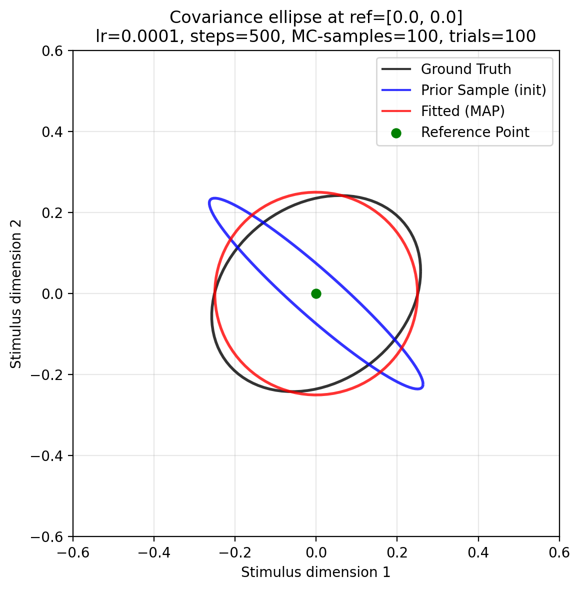
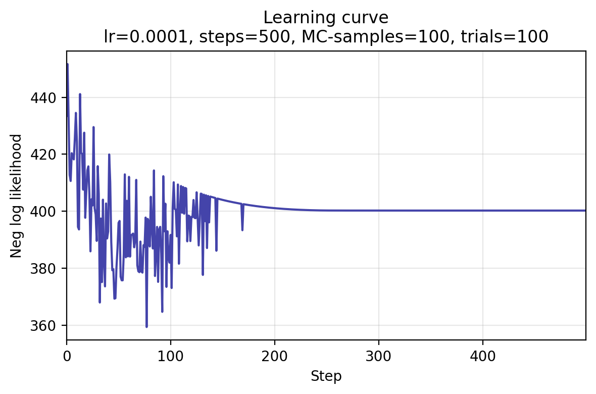

<div align="center">
	<picture>
	<source srcset="images/psyphy_logo_draft.png" media="(prefers-color-scheme: light)"/>
	<source srcset="images/psyphy_logo_draft.png"  media="(prefers-color-scheme: dark)"/>
	<!--  -->
	</picture>
	<h3>Psychophysical Modeling and Adaptive Trial Placement</h3>
</div>


<h4 align="center">
  <a href="https://flatironinstitute.github.io/psyphy/#install/">Installation</a> |
  <a href="https://flatironinstitute.github.io/psyphy/reference/">Documentation</a> |
  <a href="https://flatironinstitute.github.io/psyphy/examples/wppm/full_wppm_fit_example/">Examples</a> |
  <a href="https://flatironinstitute.github.io/psyphy/CONTRIBUTING/">Contributing</a>
</h4>


## Full Experimental Loop


```python
import jax
import jax.numpy as jnp
import optax

from psyphy.data.dataset import ResponseData
from psyphy.model import WPPM, Prior, OddityTask, GaussianNoise
from psyphy.inference.map_optimizer import MAPOptimizer
from psyphy.trial_placement.grid import GridPlacement
from psyphy.session.experiment_session import ExperimentSession

# -----------------------
# 1) Define the model
# -----------------------
prior_dist = Prior.default(input_dim=2)
decision_task = OddityTask(slope=1.5)
observer_noise = GaussianNoise(sigma=1.0)

wppm_model = WPPM(
	input_dim=2,
	prior=prior_dist,
	task=decision_task,
	noise=observer_noise,
)

# -----------------------
# 2) Choose optimizer and MAP settings
#    (explicitly configure Optax SGD + momentum)
# -----------------------
learning_rate = 5e-4
momentum = 0.9
sgd_momentum = optax.sgd(learning_rate=learning_rate, momentum=momentum)

map_estimator = MAPOptimizer(
	steps=500,
	optimizer=sgd_momentum,
)

# -----------------------
# 3) Trial placement strategy (stubbed)
# -----------------------
trial_placement = GridPlacement(grid_points=[(0.0, 0.0)])

# -----------------------
# 4) Orchestrate an experiment session
# -----------------------
session = ExperimentSession(wppm_model, map_estimator, trial_placement) # session orchestrates the loop (ini/update/propose)

# Initialize posterior (before any data)
# Note: initialize() simply calls inference.fit(model, data) and returns
# whatever that method returns (a Posterior). session just stores the instance.
posterior = session.initialize()

# Propose a batch of trials and collect responses (simulated/user-provided)
proposed_batch = session.next_batch(batch_size=5)
# responses = run_subject(proposed_batch)
# session.data.add_batch(responses, proposed_batch)

# Update posterior after adding data
posterior = session.update()

# Predict threshold contour around a reference
# This works because inference.fit(...) returned a Posterior that implements
# predict_thresholds. Session itself relies on duck typing and doesn’t need
# to reference Posterior explicitly.
reference_point = jnp.array([0.0, 0.0])
threshold_contour = posterior.predict_thresholds(
	reference=reference_point,
	criterion=0.667,
	directions=16,
)
```

## Alternative: Offline fit without the session
If you already have data and just want to fit and predict without the experiment orchestrator:

```python
from psyphy.data.dataset import ResponseData
from psyphy.model import WPPM, Prior
from psyphy.inference.map_optimizer import MAPOptimizer
import optax
import jax.numpy as jnp

# Prepare data
# Create an empty container for trials (reference, probe, response)
data = ResponseData()

# Add one trial:
# - ref: reference stimulus (shape: (input_dim,))
# - probe: probe stimulus (same shape as ref)
# - resp: binary response in {0, 1}; TwoAFC log-likelihood treats 1 as "correct"
data.add_trial(ref=jnp.array([0.0, 0.0]), probe=jnp.array([0.1, 0.0]), resp=1)

# Add another trial (subject responded 0 = "incorrect")
data.add_trial(ref=jnp.array([0.0, 0.0]), probe=jnp.array([0.0, 0.1]), resp=0)

# Model
model = WPPM(input_dim=2, prior=Prior.default(2), task=OddityTask())

# Optimizer config (SGD + momentum)
opt = optax.sgd(learning_rate=5e-4, momentum=0.9)
posterior = MAPOptimizer(steps=500, optimizer=opt).fit(model, data)

# Predictions
p = posterior.predict_prob((jnp.array([0.0, 0.0]), jnp.array([0.05, 0.05])))
contour = posterior.predict_thresholds(reference=jnp.array([0.0, 0.0]))
```

---

## Quick-start walkthrough — fit your first covariance ellipse

The snippet below shows the minimal end-to-end workflow: simulate a handful of
oddity-task trials at a **single reference point**, fit the WPPM with MAP
optimization, and visualize the result.  No GPU needed — runs in under 2 min
on CPU.

> The complete runnable script is
> [`quick_start.py`](https://github.com/flatironinstitute/psyphy/blob/main/docs/examples/wppm/quick_start.py).
> A step-by-step explanation lives in the
> [Quick-start example](examples/wppm/quick_start.md).

### Imports

```python title="Imports"
--8<-- "docs/examples/wppm/quick_start.py:imports"
```

### Compute settings

```python title="Compute settings"
--8<-- "docs/examples/wppm/quick_start.py:compute_settings"
```

### Ground-truth model + simulate data

```python title="Ground-truth model"
--8<-- "docs/examples/wppm/quick_start.py:truth_model"
```

```python title="Simulate data"
--8<-- "docs/examples/wppm/quick_start.py:simulate_data"
```

### Build model and fit

```python title="Model definition"
--8<-- "docs/examples/wppm/quick_start.py:build_model"
```

```python title="Fit with MAPOptimizer"
--8<-- "docs/examples/wppm/quick_start.py:fit_map"
```

### Results

<div align="center">
  
  <p><em>Ground truth (black), prior sample (blue), and MAP-fitted (red) covariance ellipses at the single reference point.</em></p>
</div>

<div align="center">
  
  <p><em>Negative log-likelihood over optimizer steps.</em></p>
</div>
